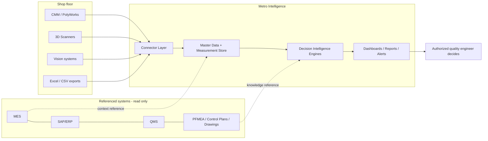

# Architecture Overview

## 1. Enterprise view

Metro Intelligence is the first product of OnKaizen's **Manufacturing Intelligence Platform**. It sits between shop-floor measurement systems (CMM/PolyWorks, scanners, vision) and quality engineering decision-making. It is a **decision support system**: it never acts on production automatically.

**Boundary rules:** MES/ERP/QMS/documents are consumed or referenced, never managed. See CLAUDE.md §2 and §16.

## 2. Logical layers

| # | Layer | Responsibility |
|---|-------|----------------|
| 1 | **Data Acquisition** | Physical/protocol access to sources: PolyWorks SDK/API, DB access, watched folders, file drops, manual upload. Prioritized: API/SDK → vendor DB → auto-export → watched folder → manual. |
| 2 | **Data Ingestion** | Receiving, queuing, deduplicating and persisting raw payloads; retention of original files (MinIO); idempotency. |
| 3 | **Validation & Normalization** | Schema/type validation, unit normalization, mapping source fields → canonical model, quarantine of invalid data with reasons. |
| 4 | **Master Data** | Part numbers, characteristics, balloon numbers, nominals, tolerances (versioned), classifications, measurement programs, inspection plans, industrial context entities. |
| 5 | **Digital Twin for Quality** | The consolidated, queryable state of quality per part/characteristic/process: current values, history, stability, context events — the substrate the engines reason over. |
| 6 | **Decision Intelligence** | The six engines (below). Deterministic, rule-based, versioned, explainable. |
| 7 | **AI / ML** | Phase 13+: anomaly detection, drift prediction, adaptive sampling models. Augments engines; rules remain the fallback. |
| 8 | **Knowledge Integration** | Phase 14+: RAG over referenced external documents (read-only), knowledge graph links, cited answers. |
| 9 | **Presentation** | React SPA: operational dashboard, executive dashboard, catalog admin, imports, recommendations inbox, reports. |
| 10 | **Security & Governance** | AuthN (JWT, later SSO/LDAP), RBAC, audit log, decision traceability, secrets, data classification. Cross-cutting. |
| 11 | **Infrastructure** | Docker Compose (demo) → optional Kubernetes; PostgreSQL, MinIO, reverse proxy, Prometheus/Grafana; fully on-premise capable. |

## 3. Decision engines

All engines live in `backend/app/engines/`, are pure (data in → results out), versioned, and persist full rationale (CLAUDE.md §23).

1. **Compliance Engine** — OK/NOK per characteristic vs. versioned tolerances; part-level disposition rollup.
2. **SPC Engine** — Cp, Cpk, Pp, Ppk, control charts (X̄-R, I-MR), Nelson + Western Electric rules, stability verdicts, trend detection.
3. **Risk Engine** — composite dimensional risk score per characteristic: proximity to limits, trend slope, historical NOK rate, process-event correlation. Output: score + contributing factors.
4. **Adaptive Inspection Engine** — inspection frequency *recommendations* (increase/decrease/keep/immediate/post-event validation) with projected NOK risk if frequency is kept or changed. Never self-applies.
5. **Recommendation Engine** — probable causes and suggested actions, ranked by criticality; links evidence.
6. **Decision Memory** — history of recommendations → human decisions → actions → outcomes; organizational learning substrate and future ML training data.

Pipeline: `Measurement ingested → Compliance → SPC → Risk → Adaptive Inspection + Recommendation → (human decision) → Decision Memory`.

## 4. Technology architecture

- **Backend:** Python 3.12, FastAPI, SQLAlchemy 2 + Alembic, Pydantic v2. **Modular monolith** (ADR-001): `app/{api,core,models,schemas,services,engines,connectors,repositories}`.
- **Frontend:** React 18 + TypeScript + Vite; charting library chosen in Phase 5 (candidates: Recharts/ECharts).
- **Database:** PostgreSQL 16; time-partitioning ready for `measurement_result`; `pgvector` extension reserved for RAG phase (ADR-003).
- **Async work:** in-process background tasks for demo; Redis Streams introduced when connectors go real-time (Phase 12); Kafka only if scale demands (needs ADR).
- **Storage:** MinIO for raw imported files.
- **Deploy:** Docker Compose behind Nginx/Traefik with TLS; Kubernetes optional for production (Phase 15–16).
- **Observability:** structured JSON logs; Prometheus metrics; Grafana dashboards (Phase 15).

## 5. Deployment models

1. **100% on-premise (default):** everything inside customer network; local LLM if AI is used; internal backups.
2. **Controlled hybrid:** sensitive data on-premise; authorized private-cloud services; no raw files leave without authorization.
3. **Dedicated private SaaS:** exclusive instance, separate DB, VPN, strong encryption, NDAs.

The codebase must never assume internet access at runtime.

## 6. Key ADRs

- ADR-001: Modular monolith over microservices for MVP.
- ADR-002: Python/FastAPI single-stack (backend + analytics + ML share one language and one deployment story; security is achieved via hardening, not stack choice).
- ADR-003: PostgreSQL 16 (no license cost per on-premise install, pgvector, partitioning, mature auditing ecosystem).
