# Conceptual Domain Model

Design before DDL: this document defines entities, relationships and rules. Physical schema (Alembic migrations) is derived from here in Phase 2. **The model anticipates the full platform; the demo implements only the subset marked ✅.**

## 1. Modules

| Module | Entities | Demo |
|---|---|---|
| `org` | Organization, Site, Area, Line, Cell | ✅ (minimal: one org/site/line) |
| `assets` | Machine, Process, Operation, Tooling, Fixture | ✅ Machine only; rest post-demo |
| `catalog` | ProductFamily, PartNumber, Characteristic, CharacteristicClassification, Specification (nominal+tolerances, versioned), MeasurementProgram, InspectionPlan, InspectionFrequency | ✅ core |
| `measurement` | MeasurementRun, MeasurementResult, MeasurementSample, ImportedFile, DataSource, Connector | ✅ (file import path) |
| `context` | ProcessEvent, ProcessParameter, Batch/Lot, Order, Material, Shift, Operator | ✅ ProcessEvent only |
| `intelligence` | RiskAssessment, Recommendation, Decision, ActionTaken, Alert | ✅ |
| `security` | User, Role, Permission, AuditLog | ✅ |
| `presentation` | Dashboard, Report | ✅ minimal |

## 2. Core relationships

```mermaid
erDiagram
    Organization ||--o{ Site : has
    Site ||--o{ Area : has
    Area ||--o{ Line : has
    Line ||--o{ Cell : has
    Cell ||--o{ Machine : hosts

    ProductFamily ||--o{ PartNumber : groups
    PartNumber ||--o{ Characteristic : defines
    Characteristic ||--o{ Specification : "versioned specs"
    Characteristic }o--|| CharacteristicClassification : classified
    PartNumber ||--o{ MeasurementProgram : "measured by"
    MeasurementProgram ||--o{ MeasurementRun : executes
    PartNumber ||--o{ InspectionPlan : "inspected per"
    InspectionPlan ||--o{ InspectionFrequency : "frequency history"

    MeasurementRun ||--o{ MeasurementSample : "parts measured"
    MeasurementSample ||--o{ MeasurementResult : "one per characteristic"
    MeasurementResult }o--|| Characteristic : measures
    MeasurementResult }o--|| Specification : "evaluated against version"
    MeasurementRun }o--o| Machine : "on"
    MeasurementRun }o--o| ImportedFile : "sourced from"
    ImportedFile }o--|| DataSource : "via"

    ProcessEvent }o--o| Line : at
    ProcessEvent }o--o| Machine : at

    Characteristic ||--o{ RiskAssessment : "risk over time"
    RiskAssessment ||--o{ Recommendation : produces
    Recommendation ||--o| Decision : "human decides"
    Decision ||--o{ ActionTaken : executes
    Recommendation ||--o{ Alert : raises

    User }o--o{ Role : has
    Role }o--o{ Permission : grants
```

## 3. Entity notes & invariants

### catalog
- **Characteristic**: belongs to a PartNumber; has `balloon_number`, name, type (diameter, position, flatness, profile…), unit, and classification (e.g., `critical/CC`, `significant/SC`, `standard`). Balloon number unique per part.
- **Specification**: versioned record of nominal + lower/upper tolerance (+ optional distinct SPC limits later). `valid_from`/`valid_to`; exactly one active per characteristic. Results reference the specification version in force — historical results never re-evaluate against new tolerances.
- **MeasurementProgram**: named program (e.g., a PolyWorks routine) mapping program outputs → characteristics; versioned.
- **InspectionPlan / InspectionFrequency**: current sampling strategy per part/characteristic; frequency changes are history rows carrying who/why (link to Decision when originated from a recommendation).

### measurement
- **MeasurementRun**: one execution of a program (a "report"): timestamp, program version, machine, operator?, batch?, source file.
- **MeasurementSample**: one physical part within a run (serial/sequence).
- **MeasurementResult**: one measured value for one characteristic of one sample. Immutable; corrections create a superseding row (`supersedes_id`). Stores value, evaluated OK/NOK, deviation, spec version used.
- **ImportedFile**: original artifact (MinIO object ref, hash for dedup, parse status, error detail).
- **DataSource/Connector**: registry of where data comes from and by which mechanism (manual upload, watched folder, API…), enabling the decoupled connector layer.

### context
- **ProcessEvent**: timestamped event (tool change, maintenance, material lot change, machine adjustment, shift change…) with free metadata (JSONB) and links to line/machine/part. Used by Risk/Recommendation engines for correlation, and by Adaptive Inspection for post-event validation.

### intelligence
- **RiskAssessment**: engine output per characteristic at a point in time: score (0–100), level, contributing factors (JSONB: proximity, trend, history, events), engine version.
- **Recommendation**: type (frequency_increase, frequency_decrease, immediate_inspection, investigate_cause, post_event_validation…), rationale text, evidence links (measurement IDs, risk assessment ID), rule/model version, state: `pending → accepted | rejected | superseded | expired`.
- **Decision**: who, when, accept/reject, comment. **ActionTaken**: what was actually done + observed outcome — closes the Decision Memory loop.
- **Alert**: severity, target roles, delivery/read state; always linked to its trigger.

### security
- **AuditLog**: append-only; actor, action, entity, before/after (JSONB), timestamp, IP. No updates or deletes ever.

## 4. Keys, history, audit
- Technical PKs: UUIDv7. Natural keys enforced as unique constraints (e.g., `part_number.code`, `(part_id, balloon_number)`).
- Versioning pattern: `valid_from/valid_to` rows for Specification, MeasurementProgram, InspectionFrequency.
- High-volume table: `measurement_result` — design for time partitioning from the start (partition key: run timestamp).
- All engine outputs carry `engine_name` + `engine_version` for reproducibility.

## 5. Explicitly out of scope (referenced only)
PFMEA/control plan/drawing content, SAP/MES/ERP records, maintenance orders, document repositories. Where linkage is needed, store **external references** (system, external ID, URL/path) — never the managed content itself.
