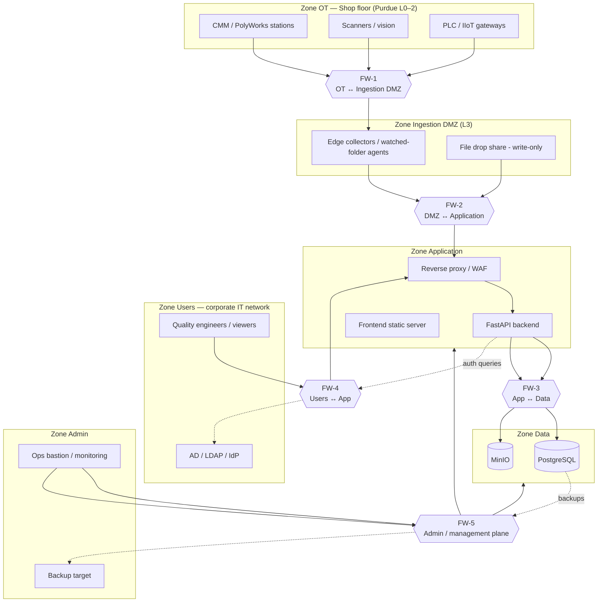

# Network Segmentation & Firewall Insertion Points

The platform is deployed inside customer infrastructure across **security zones** aligned with ISA-95 / Purdue levels. Each zone boundary is a **firewall insertion point** with an explicit, minimal allowlist. Default posture: **deny all between zones; allow only documented flows.**

## 1. Zone model

## 2. Firewall insertion points & allowed flows

| FW | Boundary | Allowed flows (only these) | Rationale / threats blocked |
|---|---|---|---|
| **FW-1** | OT / shop floor → Ingestion DMZ | Measurement stations push exports to collector or drop share (SMB/SFTP, one direction, write-only). Collectors may pull via vendor API on fixed ports to fixed hosts. **No flow from IT into OT.** | Protects OT from IT-side compromise; malware on an office PC cannot reach machines. Platform never sends commands toward machines (also a product rule). |
| **FW-2** | Ingestion DMZ → Application | Collector → API `POST /api/v1/imports/*` over TLS (mTLS for agents), single port. No DMZ → Data zone flow ever. | A compromised collector can only reach one authenticated upload endpoint, not the DB. File-based attacks land in quarantine/validation, not in the core. |
| **FW-3** | Application → Data | API host → PostgreSQL :5432 and MinIO :9000 only, from app service accounts. No user network → Data zone. No Data zone egress. | DB and object store are never directly reachable by users, agents, or OT. Blocks lateral movement and direct exfiltration. |
| **FW-4** | Corporate users → Application | HTTPS :443 to reverse proxy/WAF only. API → IdP (LDAPS :636 / OIDC) for auth. | Single audited entrance; WAF handles rate limiting, header hygiene, TLS termination; no direct access to backend containers. |
| **FW-5** | Admin plane ↔ all zones | Bastion (MFA) → SSH/manage on specific hosts; Prometheus scrape one-way pull; DB → backup target push, encrypted. | Management traffic separated from user traffic; backups can't be reached from user/OT zones (ransomware resilience). |

**Egress rule for every zone:** no internet egress required or allowed in the default on-premise deployment. Any hybrid flow (Deployment model 2/3) gets its own explicit firewall rule, TLS, and written authorization.

## 3. Most vulnerable surfaces → mandated placement

1. **File ingestion path** (highest exposure: parses external content) → isolated in DMZ + validated/quarantined before touching Zone Data; parser runs with least privilege; raw files stored in a dedicated MinIO bucket with no public policy.
2. **Auth endpoints** → behind WAF rate limiting + lockout; only via FW-4.
3. **Database** → double-walled (FW-3 + FW-4 both block direct access); credentials scoped per service; no superuser app account.
4. **Admin interfaces** (MinIO console, Grafana, DB tools) → Zone Admin only, never exposed through FW-4.
5. **Future RAG/LLM services** → their own sub-zone inside Application; embeddings/LLM containers have **no** network route except API ↔ vector store.

## 4. Demo vs production

- **Demo (single host, Docker Compose):** zones are emulated with Docker networks (`net_dmz`, `net_app`, `net_data`) — DB and MinIO attach only to `net_data`, published ports bound to `127.0.0.1`, reverse proxy is the only exposed service. Same topology, software-defined.
- **Production:** zones map to customer VLANs/firewalls; this document is the input for the customer's network security review. Kubernetes deployments express the same boundaries as NetworkPolicies.

Any new component must declare its zone and required flows in its ADR before implementation.
